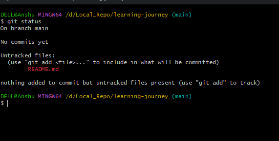
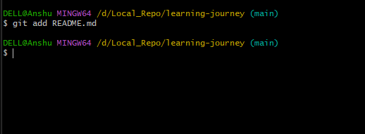
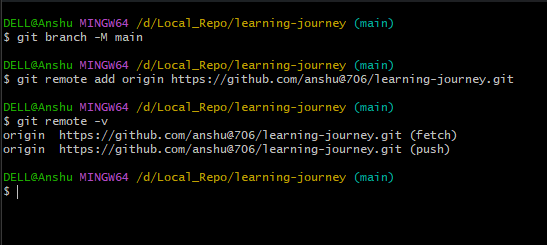

Sample README Content

# My Learning Journey 🚀

This repository documents my journey as a software developer.

## What I’m Learning

- Python & Django
- REST APIs
- Docker & Kubernetes
- Git & GitHub
- System Design

## Goals

- Improve backend engineering skills
- Build real-world projects
- Crack software engineering interviews

## Progress

I will continuously update this repository with my learnings and projects.

---

# This are the Images, how this code is done/uploaded.

           
